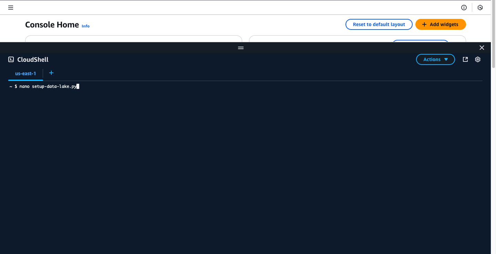
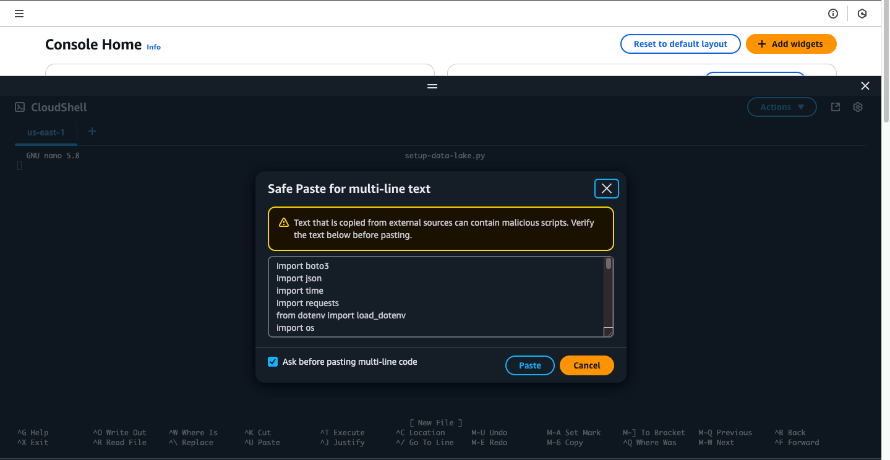
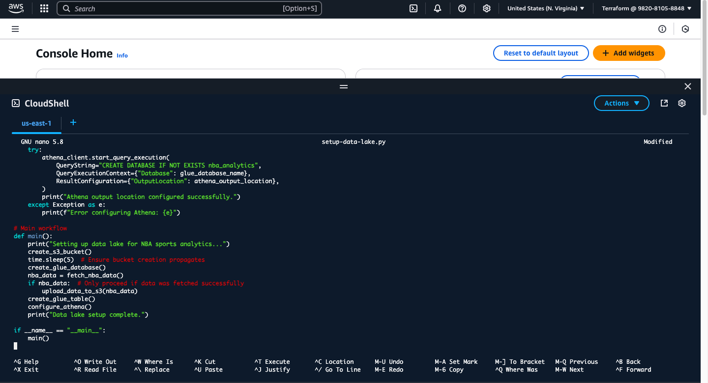
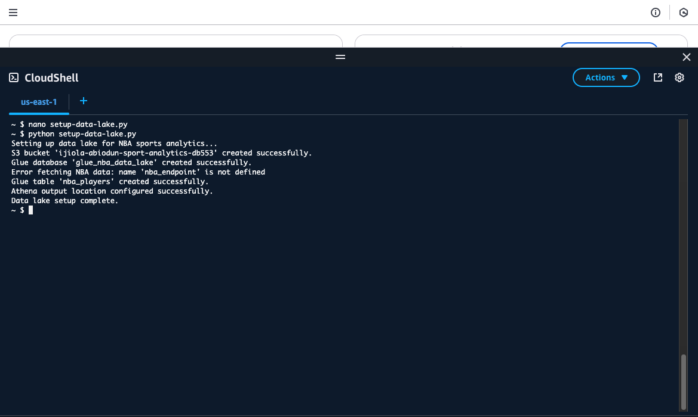
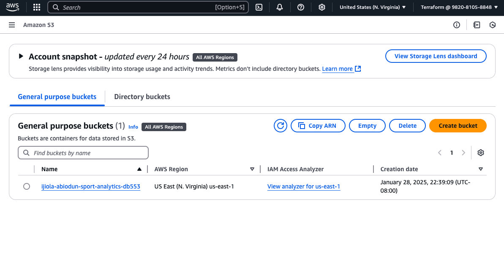

# NBADataLake
This repository contains the `setup_nba_data_lake.py` script, which automates the creation of a data lake for NBA analytics using AWS services. The script integrates Amazon S3, AWS Glue, and Amazon Athena, and sets up the infrastructure needed to store and query NBA-related data.

# Overview
The `setup_nba_data_lake.py` script performs the following actions:

- Creates an Amazon S3 bucket to store raw and processed data.
- Uploads sample NBA data (JSON format) to the S3 bucket.
- Creates an AWS Glue database and an external table for querying the data.
- Configures Amazon Athena for querying data stored in the S3 bucket.

# Prerequisites
Before running the script, ensure you have the following:

1. Go to Sportsdata.io and create a free account.
2. At the top left, you should see "Developers", if you hover over it you should see "API Resources".
3. Click on "Introduction & Testing".
4. Click on "SportsDataIO API Free Trial" and fill out the information & be sure to select NBA for this tutorial.
5. You will get an email and at the bottom it says "Launch Developer Portal".
6. By default, it takes you to the NFL, on the left click on NBA.
7. Scroll down until you see "Standings".
8. You'll see "Query String Parameters", the value in the drop-down box is your API key. 
9. Copy this string because you will need to paste it later in the script.

IAM Role/Permissions: Ensure the user or role running the script has the following permissions:

- S3: `s3:CreateBucket`, `s3:PutObject`, `s3:DeleteBucket`, `s3:ListBucket`
- Glue: `glue:CreateDatabase`, `glue:CreateTable`, `glue:DeleteDatabase`, `glue:DeleteTable`
- Athena: `athena:StartQueryExecution`, `athena:GetQueryResults`

## **Prerequisites**
- Free account with subscription and API Key at [SportsData.io](https://sportsdata.io/)
- Personal AWS account with a basic understanding of AWS and Python.

---

# START HERE 
## Step 1: Open CloudShell Console

1. Go to aws.amazon.com & sign into your account.
2. In the top, next to the search bar you will see a square with a >_ inside, click this to open the CloudShell.

## Step 2: Create the `setup_nba_data_lake.py` file
1. In the CLI (Command Line Interface), type:
    ```bash
    nano setup_nba_data_lake.py
    ```



2. In another window, go to [GitHub](https://github.com/Stormz99/nba_data_lake.git).
3. Copy the contents inside the `setup_nba_data_lake.py` file.

4. Go back to the CloudShell window and paste the contents inside the file.

5. Find the line of code under #Sportsdata.io configurations that says "api_key" and paste your API key inside the quotations.
6. Press `^X` to exit, press `Y` to save the file, press enter to confirm the file name.

## Step 3: Create `.env` file
1. In the CLI (Command Line Interface), type:
    ```bash
    nano .env
    ```
2. Paste the following line of code into your file, ensure you swap out with your API key:
    ```bash
    SPORTS_DATA_API_KEY=your_sportsdata_api_key
    NBA_ENDPOINT=https://api.sportsdata.io/v3/nba/scores/json/Players
    ```
3. Press `^X` to exit, press `Y` to save the file, press enter to confirm the file name.

## Step 4: Run the script
1. In the CLI type:
    ```bash
    python3 setup_nba_data_lake.py
    ```
    - You should see the resources were successfully created, the sample data was uploaded successfully and the Data Lake Setup Completed.

## Step 5: Manually Check For The Resources
1. In the Search Bar, type S3 and click the blue hyperlink name.
    - You should see 2 General purpose buckets named "Sports-analytics-data-lake".
    - When you click the bucket name you will see 3 objects are in the bucket.

2. Click on `raw-data` and you will see it contains `nba_player_data.json`.
3. Click the file name and at the top you will see the option to Open the file.
    - You'll see a long string of various NBA data.
4. Head over to Amazon Athena and you could paste the following sample query:
    ```sql
    SELECT FirstName, LastName, Position, Team
    FROM nba_players
    WHERE Position = 'PG';
    ```
    - Click Run.
    - You should see an output if you scroll down under "Query Results".

### **What I Learned**
1. Securing AWS services with least privilege IAM policies.
2. Automating the creation of services with a script.
3. Integrating external APIs into cloud-based workflows.
